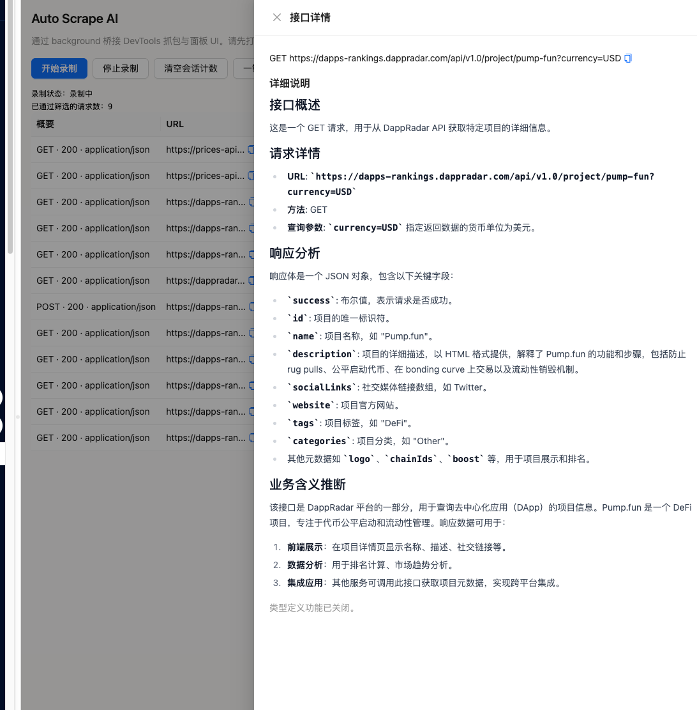

# Auto Scrape AI（Auto Scrape AI）

基于 [WXT](https://wxt.dev/) 与 React 的浏览器扩展：在 **Chrome 开发者工具** 中抓取 HTTP 流量，对请求/响应做摘要与裁剪，并通过 **兼容 OpenAI 的 API** 生成接口的简短说明与详细说明（提示词默认要求使用**简体中文**输出描述）。

**语言：** [English](README.en.md) · 简体中文（本页）



## 功能概览

- **DevTools 面板**（名称：`Auto Scrape AI`）：开始/停止录制、以表格展示已捕获请求、显示桥接/录制状态提示。
- **网络抓取**：在 DevTools 扩展上下文中使用 `chrome.devtools.network`（可稳定读取 **响应体**）。
- **过滤规则**：域名（正则或 `current-tab-host`）、HTTP 方法、扩展名（如 `.js`、`.css`、图片等）、以及按 Content-Type 忽略图片/音视频、`text/plain`、常见二进制与流媒体类型。
- **数据精炼**：请求头黑名单、JSON 数组截断与同结构去重、可配置的响应体长度与数组条数上限。
- **AI 分析**：使用 OpenAI 官方 SDK，连接用户在选项里配置的 **Base URL**、**API Key**、**模型**；内置并发队列（默认最多 2 路）、单次分析超时（60 秒）、界面可重试；提示词侧会压缩摘要，并对同一 URL 路径下重复的响应摘要做占位替换以节省 token。
- **界面**：[Ant Design](https://ant.design/) 中文语言包 + **Tailwind CSS v4**（`assets/tailwind.css` 中引入 `antd/dist/reset.css`）。

## 快速开始

### 方式一：从 GitHub Releases 下载预构建包

1. 访问项目的 [GitHub Releases](https://github.com/wangyi12358/auto-scrape-ai/releases) 页面
2. 下载最新版本的 `.zip` 文件（例如 `auto-scrape-ai-1.0.0.zip`）
3. 解压下载的 `.zip` 文件到本地目录
4. 打开 Chrome 浏览器，进入 `chrome://extensions/`
5. 开启右上角的 **开发者模式**
6. 点击 **加载已解压的扩展程序**，选择解压后的目录
7. 在目标页面按 **F12**，切换到 **Auto Scrape AI** 面板
8. 在 **扩展选项** 中填写 API 与过滤、采样等设置

### 方式二：从源码构建开发

```bash
bun install   # 或: bun install
cp .env.example .env.local   # 可选：本地默认配置（见下文）
bun dev       # 或: bun dev
```

在 `chrome://extensions` 中加载 **未打包扩展**，目录一般为 `.output/chrome-mv3-dev`（具体以当前 WXT 版本为准）。在目标页面按 **F12**，切换到 **Auto Scrape AI** 面板。在 **扩展选项** 中填写 API 与过滤、采样等设置。

## 配置说明

### 选项页

在 `chrome://extensions` → **Auto Scrape AI** → **扩展程序选项**（或通过弹窗调用 `browser.runtime.openOptionsPage()`）。

### 使用 `.env.local` 覆盖默认值

构建时 WXT 会将环境变量注入 `import.meta.env`。以下变量用于生成**默认设置**，并与 `browser.storage.local` 中的用户配置合并（实现见 `lib/types/defaults.ts`）：

| 变量 | 作用 |
|------|------|
| `WXT_DEFAULT_OPENAI_API_KEY` | 默认 API Key |
| `WXT_DEFAULT_OPENAI_BASE_URL` | 兼容 OpenAI 的 Base URL（如 `https://api.openai.com/v1`） |
| `WXT_DEFAULT_OPENAI_MODEL` | 模型 ID |
| `WXT_DEFAULT_INCLUDE_RULES` | 逗号或换行分隔；可使用 `current-tab-host` 或主机正则 |
| `WXT_DEFAULT_TARGET_LANGUAGE` | 分析相关偏好（写入设置） |
| `WXT_DEFAULT_SCHEMA_TYPE` | 结构/风格偏好（写入设置） |

可将 `.env.example` 复制为 `.env.local` 后修改。**请勿**将密钥提交到版本库。

## 目录结构

| 路径 | 说明 |
|------|------|
| `entrypoints/background.ts` | 后台 Service Worker |
| `entrypoints/devtools/` | DevTools 引导页、桥接、**网络抓取**（`capture.ts`） |
| `entrypoints/devtools-panel/` | DevTools 面板 React 界面（表格、AI 分析、详情抽屉） |
| `entrypoints/popup/`、`entrypoints/options/` | 工具栏弹窗与选项页 |
| `entrypoints/content.ts` | 内容脚本（如启用） |
| `assets/tailwind.css` | Tailwind v4 与 Ant Design reset |
| `lib/types/` | 设置与 `CapturedRequest` 等类型 |
| `lib/messages.ts` | `runtime.connect` 桥接消息类型 |
| `lib/filter.ts` | 过滤与路径扩展名 |
| `lib/refine.ts` | `refineRequest`、`truncateJsonArrays` |
| `lib/ai/analyze-request.ts` | OpenAI 调用、提示词、`EndpointAnalysis` 解析 |
| `lib/settings-storage.ts` | `storage.local` 读写与校验 |
| `lib/messaging/bridge-role.ts` | 区分 DevTools 与面板端的端口 |
| `docs/tasks/` | 分任务实现说明 |

## 架构说明

**完整响应体**只在 **DevTools** 脚本中通过 `chrome.devtools.network` 读取，单独的面板页面无法替代这一能力。面板通过后台/DevTools 桥接（`lib/messages.ts` 中的 `BRIDGE_PORT_NAME`）接收捕获数据。总体分工见 `lib/architecture.ts`。

## 脚本命令

| 命令 | 说明 |
|------|------|
| `bun dev` / `bun dev` | WXT 开发模式 |
| `bun dev:firefox` | Firefox 开发模式 |
| `bun build` | 生产构建 |
| `bun zip` | 构建 Chrome 扩展发布包（.zip 文件） |
| `bun zip:firefox` | 构建 Firefox 扩展发布包（.zip 文件） |
| `bun compile` | `tsc --noEmit` |
| `bun test` / `bun test lib/` | 单元测试（如精炼逻辑） |
| `bun check` / `bun fix` | Ultracite（Biome）检查或自动修复 |

## 许可与隐私

API Key 与抓取的流量仅在扩展与用户配置的 AI 服务端之间处理；使用前请遵守服务商条款及目标网站的规则与法律要求。
