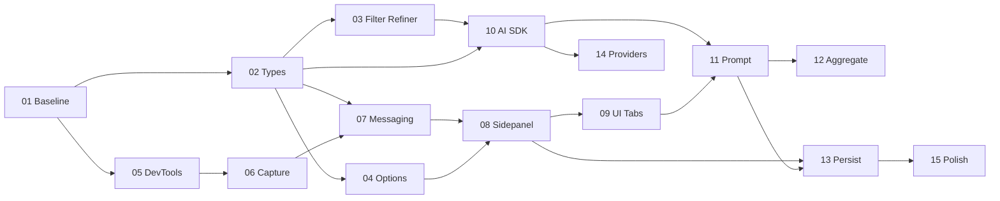

# 开发任务索引（按推荐顺序）

这些文件用于**分步实现** WXT + AI SDK 的「流量 → 结构化数据」扩展。建议严格按依赖顺序推进；某一任务未完成时，后续任务可能阻塞。

**仓库目录约定**（任务 01 落地）：见仓库根目录 [`README.md`](../../README.md) 中的 *Project layout*。

| 顺序 | 文件 | 一句话 |
|------|------|--------|
| 1 | [01-project-baseline.md](./01-project-baseline.md) | 工程基线：目录、Manifest、权限与脚本约定 |
| 2 | [02-domain-types-and-messages.md](./02-domain-types-and-messages.md) | 领域类型与 DevTools ↔ UI 消息协议 |
| 3 | [03-filter-engine-and-refiner.md](./03-filter-engine-and-refiner.md) | 过滤引擎 + Refiner（纯函数、可单测） |
| 4 | [04-options-page-and-storage.md](./04-options-page-and-storage.md) | Options 配置页与 `storage` 读写 |
| 5 | [05-devtools-entrypoint.md](./05-devtools-entrypoint.md) | DevTools 入口（`devtools_page`）与空白面板 |
| 6 | [06-network-capture-onrequestfinished.md](./06-network-capture-onrequestfinished.md) | `onRequestFinished` 采集与初筛 |
| 7 | [07-messaging-sidepanel-background.md](./07-messaging-sidepanel-background.md) | 长连接/消息：DevTools、Background、Sidepanel |
| 8 | [08-sidepanel-shell-and-store.md](./08-sidepanel-shell-and-store.md) | Sidepanel 壳层与全局状态（录制、列表） |
| 9 | [09-request-list-and-detail-tabs.md](./09-request-list-and-detail-tabs.md) | 左列表 + 右详情 Tab（文档 / 模型 / 代码） |
| 10 | [10-ai-sdk-integration-streaming.md](./10-ai-sdk-integration-streaming.md) | AI SDK 接入与 `streamText` |
| 11 | [11-prompt-templates-and-single-request-analysis.md](./11-prompt-templates-and-single-request-analysis.md) | Prompt 模板与单请求分析闭环 |
| 12 | [12-aggregate-site-analysis.md](./12-aggregate-site-analysis.md) | 「全站聚合」二次精炼与一次大模型调用 |
| 13 | [13-persist-capture-and-analysis.md](./13-persist-capture-and-analysis.md) | 持久化：配置、捕获列表、分析结果 |
| 14 | [14-local-and-alternate-providers.md](./14-local-and-alternate-providers.md) | Ollama / 自建网关等多 Provider |
| 15 | [15-polish-icons-build-and-docs.md](./15-polish-icons-build-and-docs.md) | 图标、构建、多浏览器与简短说明 |

## 依赖关系（简图）

完成某一任务后，可在对应文件末尾自行勾选「验收清单」。
